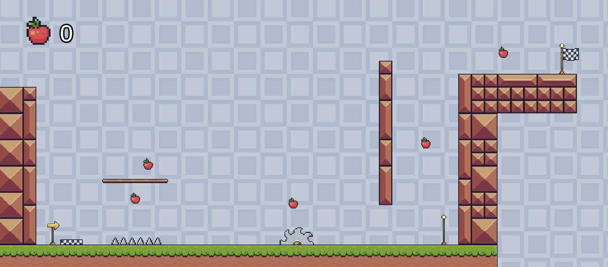
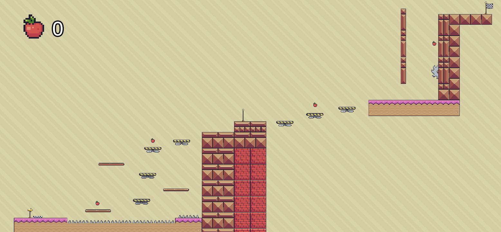
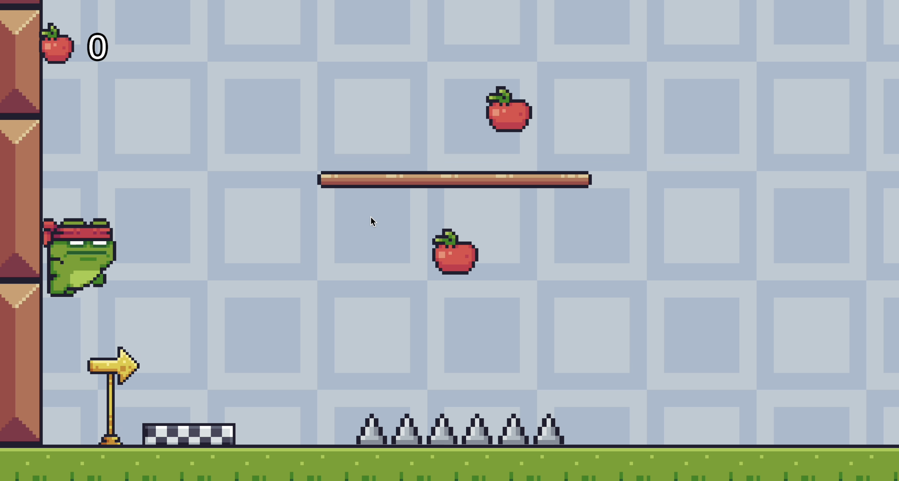
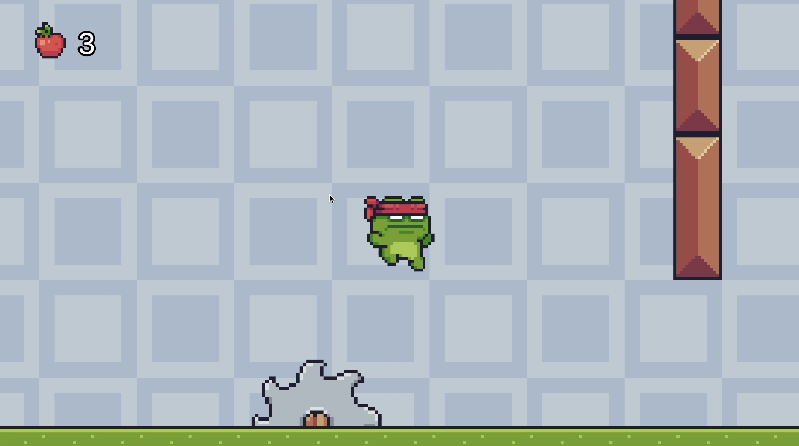
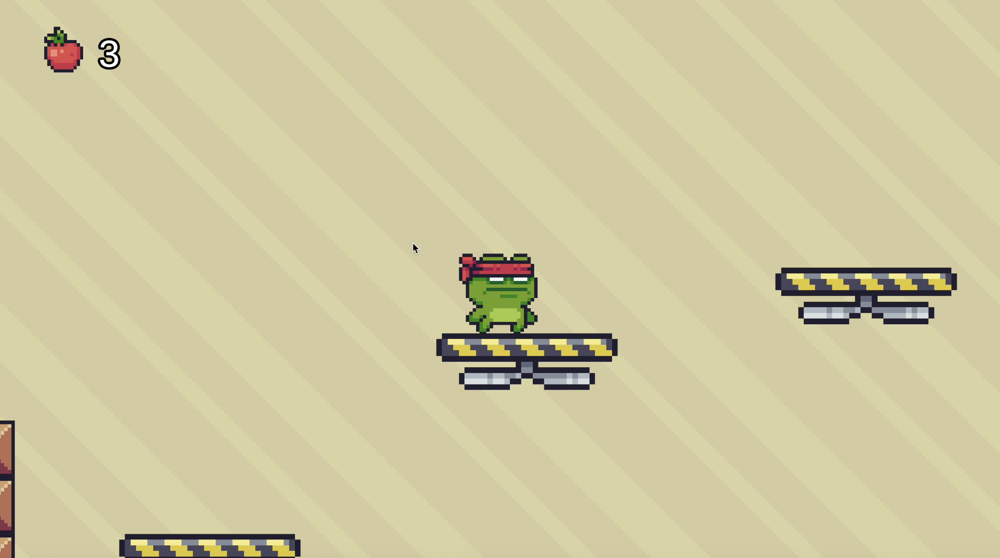

# 🐸 2D Platformer Game Prototype

This prototype is a 2D platformer featuring two levels. It showcases creative use of Unity assets and custom mechanics to offer an engaging gameplay experience.

## Features and Mechanics
* Free Assets and Tilemap
    * Utilized [free assets from the Unity Store](https://assetstore.unity.com/packages/2d/characters/pixel-adventure-1-155360?srsltid=AfmBOooL55lI0eiooivNP7t_BFGHvhxszAbAztk__auw_NlSBR7fob8j) to construct environments and characters.
    * Created a tilemap for level design.
* Character Animation
    * Animated states: idle, jump, fall, and wall sliding.

* Wall Jumping
  * Essential mechanic to navigate Level 1.

* Collectible UI System
  * Includes collectible items and a counter for player tracking.

* CheckPoints
  * Each level contains one checkpoint that allows players to save their progress and respawn nearby if they face a challenge.

* Traps
  * Spikes
  * Moving Saw: Introduced in Level 1 and appears on the wall in Level 2 for increased challenge.
  * Falling Platforms: Present in Level 2. Platforms respawn if needed for repeated crossings.

## Visuals

* An overview of Level 1, showcasing platform layouts and initial obstacles.
---

* An expansive look at Level 2, showing the increase in complexity with addition of falling platforms.
---

* The player uses wall sliding to navigate vertical sections, with the opportunity to perform a wall jump to reach floating platforms.
---

* The player jumps over a moving saw.
---

* The player stands on a falling platform, with another platform behind already going down.

